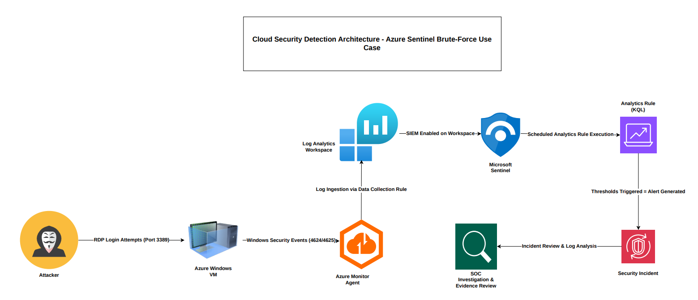

# Azure Sentinel Brute-Force Detection Lab

## Overview

This project demonstrates how to use Microsoft Sentinel to detect brute-force RDP authentication attempts against a Windows virtual machine in Microsoft Azure as part of a cloud-native SIEM solution.

The lab replicates multiple unsuccessful attempts to log in (Event ID 4625) and verifies end-to-end detection, from automated incident generation and investigation to log ingestion.

---

## Threat Context

RDP and other internet-exposed services are frequently the target of brute-force attacks, a common credential access tactic. In cloud environments, automated authentication attacks and password spraying can affect exposed virtual machines that are not properly monitored.

This project's focus is to use Windows Security Events to detect unusual authentication behaviour and turn that information into Microsft Sentinel security incidents that can be taken action on.

---

## MITRE ATT&CK Mapping

- **Tactic:** Credential Access  
- **Technique:** Brute Force (T1110)  
- **Sub-technique:** Password Guessing (T1110.001)

---

## Cloud Security Detection Architecture

📄 High-Resolution Architecture Diagram (PDF):  
[Download Architecture Diagram (PDF)](architecture-diagram-sentinel.pdf)

---

## Detection Logic

The Windows Security Event ID 4625 (failed attempts at login) is tracked by the scheduled analytics rule. Multiple failed login attempts within a defined time frame that show behaviour consistent with brute-force activites triggers the detector.

A security incident is automatically created by Microsoft Sentinel for investigation when the preset threshold is exceeded.

---

## Key Skills Demonstrated

- Azure infrastructure deployment  
- Log Analytics Workspace configuration  
- Azure Monitor Agent implementation  
- Windows Security Event ingestion  
- KQL query development  
- Detection engineering  
- Incident investigation within Microsoft Sentinel  
- Cloud security monitoring architecture  

---

## Full Technical Report

📄 [Download Full Project Report (PDF)](Microsoft-Azure-Project-Azure-Sentinel-Brute-Force-Detection-Lab.pdf)

---

## Conclusion

This project successfully validated a cloud-native detection pipeline capable of identifying brute-force authentication behaviour within an Azure-hosted environment. By operationalizing Windows Security telemetry into automated incident generation, the lab demonstrates practical detection engineering and cloud security monitoring capabilities aligned with modern SOC workflows.
